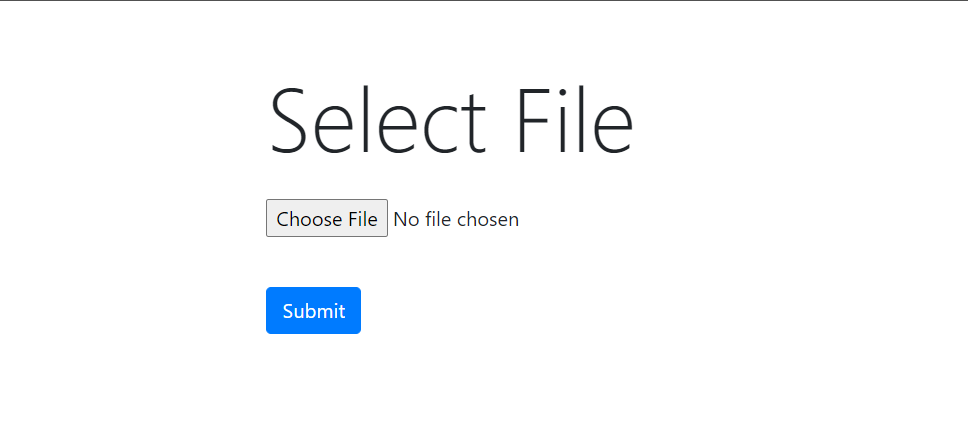
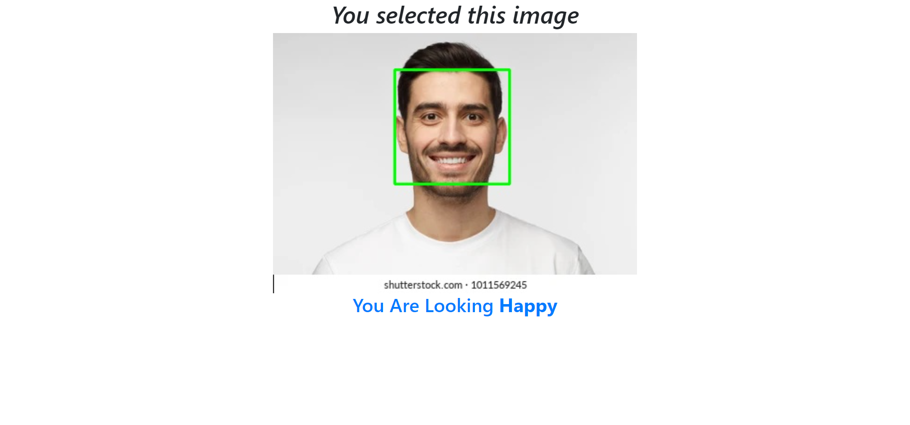

# **Title: Facial Expression Recognition**

## **1. Methodology**

The model is constructed by applying Keras sequential method. The model has 6 convolution layers, followed by maxpooling of size 2.The activation function here used is relu for the hidden layers and softmax for the output layer.

## **2. Description**

This webapp take a image from user as input and can detect the face in that image and predict the face expression for the same image.

## **3. Input / Output**

## **4. Live link**

Link: NA

## **5. Screenshot of the Interface**

